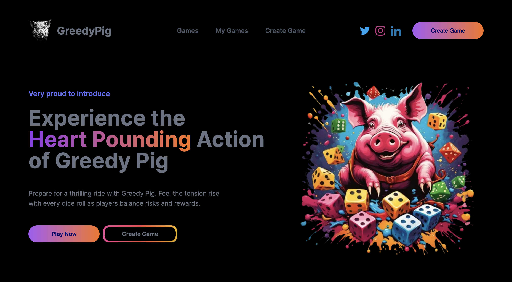

## GreedyPig

Our project aims to develop an engaging and interactive dice/roulette game. Whether you're hosting an event or enjoying a game night with friends, Greedy Pig promises endless excitement and the chance to win enticing prizes based on your gaming skills. By blending entertainment with cutting-edge technology, our game enhances event experiences and offers participants the chance to win prizes based on their gameplay prowess.

Greedy Pig is designed to be adaptable, offering multiple options such as using either a roulette or a dice as the item of play, determining game end conditions (e.g., reaching a specific score or number of turns), and optionally including a moderator to manage game flow.

The game supports two or more players, fostering a lively and competitive environment.

### Gameplay Mechanics:
Players roll a six-sided die to accumulate points.
Rolling a one ends the player's turn, resulting in the loss of all accumulated points for that turn.
Players have the option to either keep their score and pass the die or continue rolling to potentially increase their score, risking losing it all if they roll a one.

### Scoring & Strategy: 
Success hinges on strategic decision-making, balancing risk and reward to maximize point accumulation without succumbing to greed.

#### Game Conclusion & Rewards: 
The game ends either when the agreed-upon number of turns is reached or when a player achieves the target score. The winner, determined by the highest score, receives the accumulated prize pool when in the game is in betting mode.

Greedy Pig stands as an innovative fusion of entertainment and technology, poised to captivate event attendees while exemplifying the potential of Convex Database for real-time update.

[Demo](https://github.com/cjustinobi/greedy-pig)